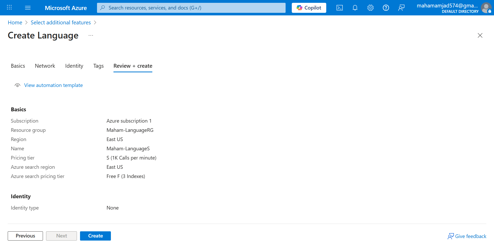
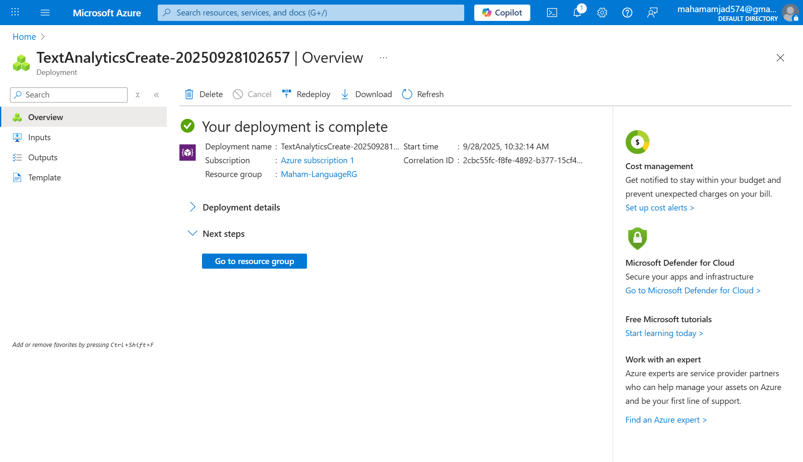
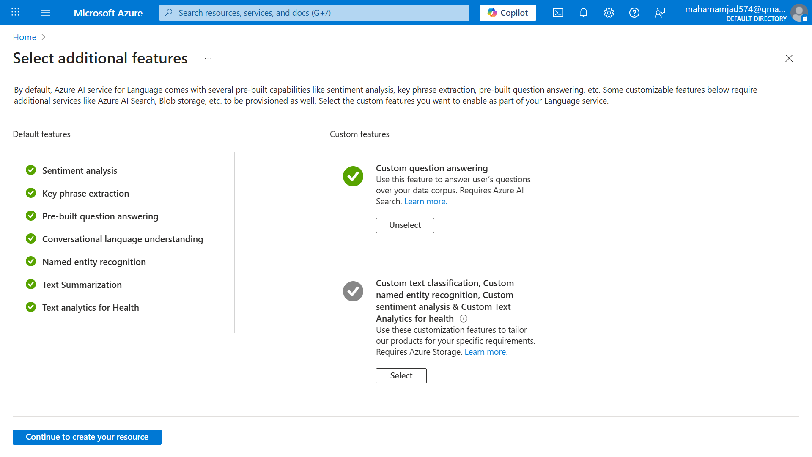
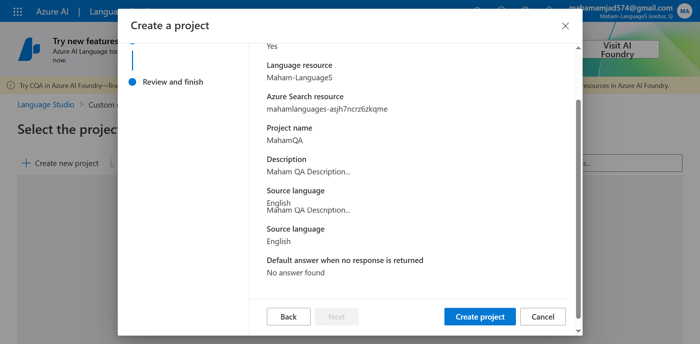
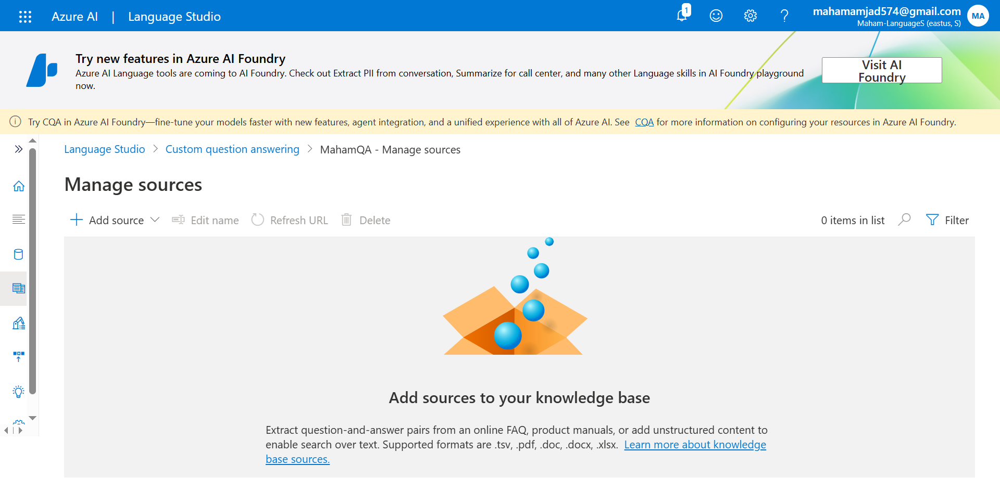
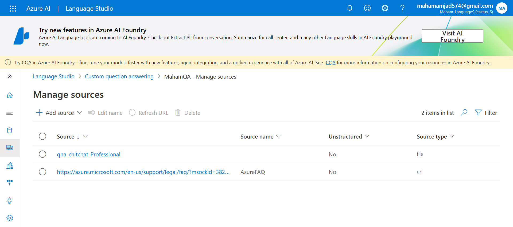
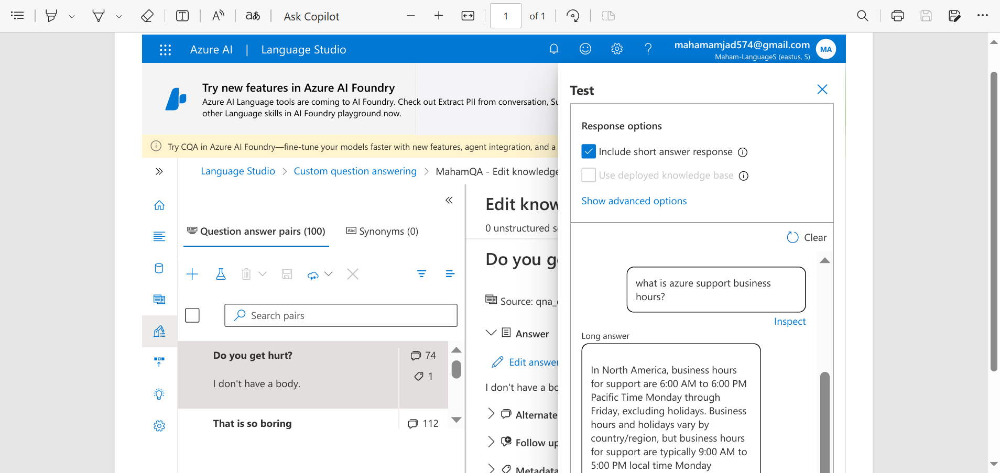
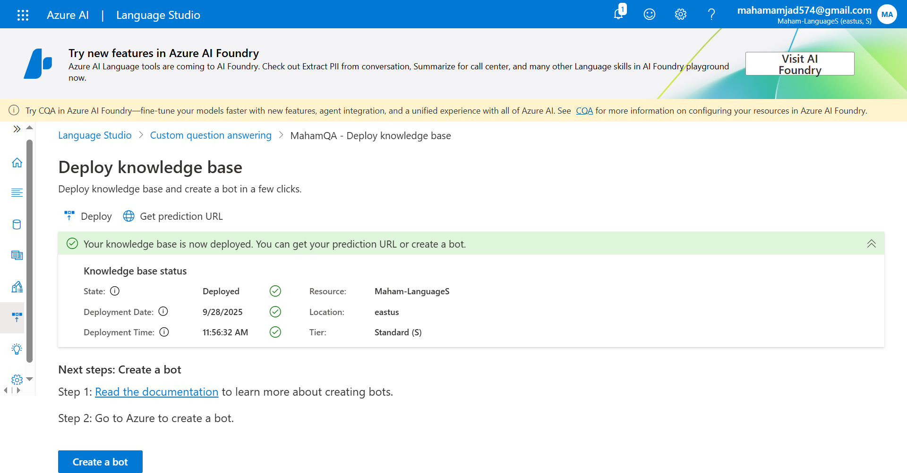

# Azure-QnA-Chatbot
Added complete Azure QnA Chatbot project.

Azure Custom Question Answering Chatbot
This project is a practical implementation of the Custom Question Answering feature within Microsoft Azure's AI services. I have built an intelligent chatbot that can answer questions from its own knowledge base.

🎯 Project Overview
Using the Azure AI Language service, I created a chatbot system that:

Custom Knowledge Base: Learns from your own data (URLs)
Chit-Chat Feature: Can converse in a professional style
Smart QnA Management: Can edit and add questions
Live Testing: Can be tested in real-time
Cloud Deployment: Deployed for production use

🛠️ Azure Services Used
Azure AI Language Service - Core NLP service

## 🖼️ Project Implementation Journey

### 1. Azure Service Creation
First step: Creating AI service in Azure

### 2. Successful Deployment
Service successfully deployed

### 3. Custom QnA Selection
Selected Custom Question Answering in AI Language service

### 4. Project Setup
Manually created new project for knowledge base

### 5. Knowledge Sources Management
Manage Sources" screen - where data is added from

### 6. Add Content & Personality
Added URL and enabled Chit-Chat (Professional) feature

### 7. Testing & Customization
Edited/added questions and performed real-time testing

### 8. Production Deployment
Finally deployed knowledge base for production

🚀 Key Features Tested

✅ Knowledge Base Creation - Automatically generating QnA pairs from URLs

✅ Chit-Chat Integration - Adding professional personality

✅ Question Management - Adding and editing custom questions

✅ Real-time Testing - Testing in live interface

✅ Deployment Workflow - Publishing to production environment

💡 Technical Learnings

Cloud AI Setup:

How to set up AI services in Azure portal

NLP Configuration: How to configure Natural Language Processing features

Data Integration: How to integrate your content into AI system

Testing Methodology: How to systematically test AI models

🔮 Future Enhancements

Add multi-language support
Build custom web interface
Integrate more data sources (PDFs, databases)
Add advanced analytics

This project demonstrates the practical use of Azure AI services and shows real-world AI implementation skills.

Custom Question Answering - For managing QnA pairs

Azure AI Search - For quickly finding answers
